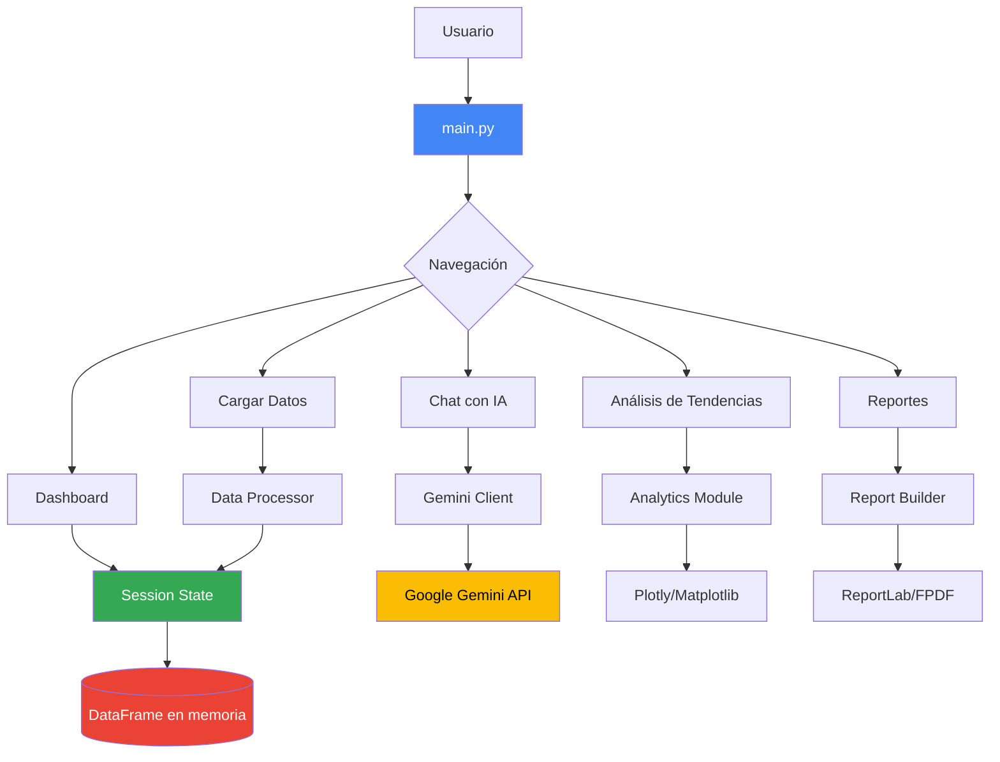
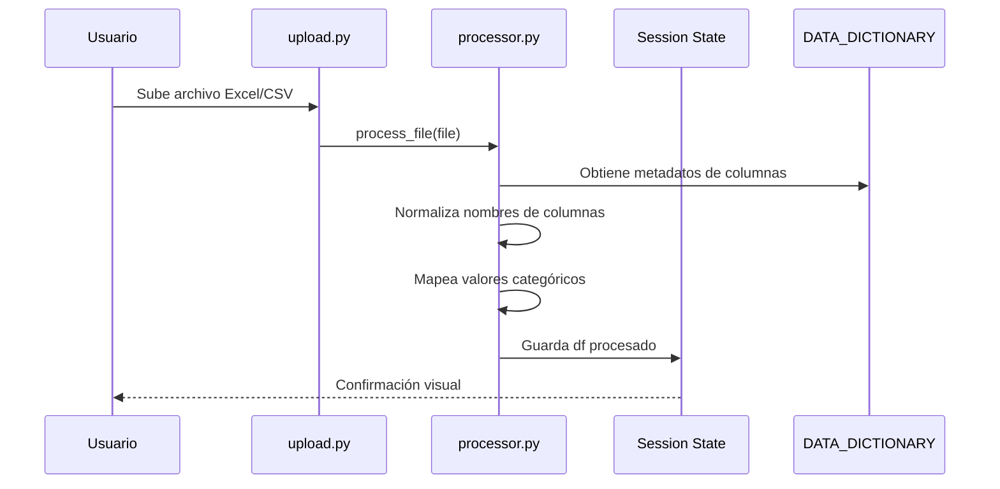
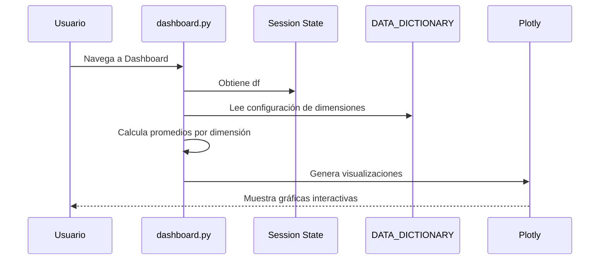
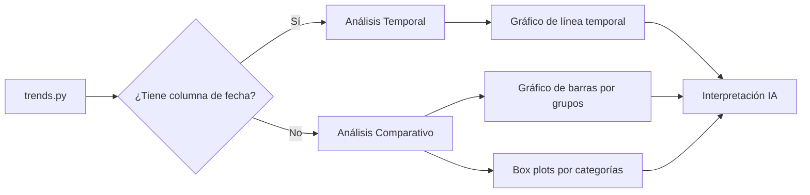
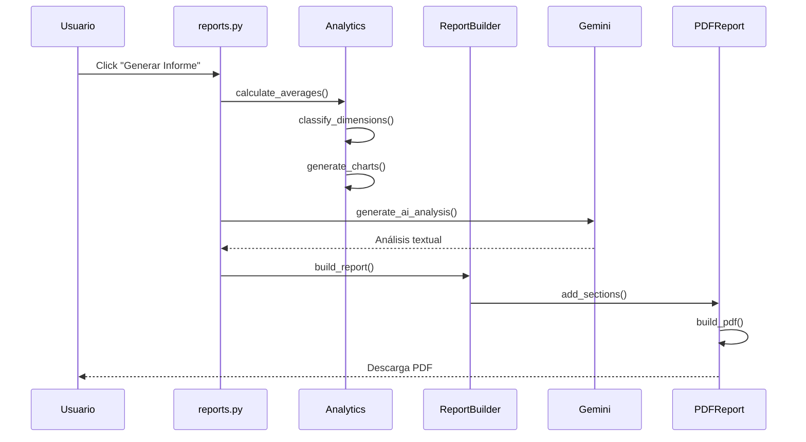

# Documentación Técnica - Observatorio de Salud Organizacional

## Índice

1. [Resumen Ejecutivo](#resumen-ejecutivo)
2. [Arquitectura de la Aplicación](#arquitectura-de-la-aplicación)
3. [Flujo de Datos](#flujo-de-datos)
4. [Módulos Principales](#módulos-principales)
5. [Configuración y Despliegue](#configuración-y-despliegue)

---

## Resumen Ejecutivo

La aplicación **Observatorio de Salud Organizacional** es una herramienta analítica desarrollada en Streamlit diseñada para hacer accesibles los resultados de estudios de bienestar laboral y salud mental a diversos stakeholders:

- 🏢 **Empresas**: Análisis de clima organizacional y riesgos psicosociales
- 🎓 **Colegios**: Evaluación del ambiente escolar
- 👨‍👩‍👧 **Padres**: Seguimiento del bienestar de estudiantes
- 🏛️ **Gobierno**: Datos agregados para políticas públicas

### Tecnologías Principales

- **Streamlit**: Framework web para visualización interactiva
- **Plotly & Matplotlib**: Visualizaciones de datos
- **Pandas**: Procesamiento y análisis de datos
- **Google Gemini API**: Análisis de IA generativa
- **ReportLab & FPDF**: Generación de informes PDF
- **Supabase (opcional)**: Base de datos en la nube

---

## Arquitectura de la Aplicación

### Estructura del Proyecto

```
SaludOrganizacional/
├── main.py                          # Punto de entrada de la aplicación
├── src/
│   ├── core/                        # Funcionalidades centrales
│   │   ├── config.py               # Configuración y diccionario de datos
│   │   ├── state.py                # Gestión de estado de sesión
│   │   └── ai.py                   # Funciones de IA
│   ├── ui/                         # Componentes de interfaz
│   │   ├── dashboard.py            # Panel principal con visualizaciones
│   │   ├── chat.py                 # Chat con IA
│   │   ├── trends.py               # Análisis de tendencias
│   │   ├── upload.py               # Carga de datos
│   │   └── reports.py              # Generación de reportes
│   ├── ai/                         # Integración con Gemini
│   │   └── gemini_client.py        # Cliente para API de Gemini
│   ├── reports/                    # Sistema de reportes
│   │   ├── analytics.py            # Análisis estadístico
│   │   ├── pdf_generator.py        # Generación base de PDF
│   │   └── report_builder.py       # Constructor de informes completos
│   └── data/                       # Procesamiento de datos
│       ├── processor.py            # Procesamiento principal
│       ├── preprocessor.py         # Limpieza de datos
│       └── supabase_client.py      # Conexión a Supabase
├── tests/                          # Pruebas automatizadas
├── scripts/                        # Scripts de utilidad
└── .streamlit/
    └── config.toml                 # Configuración de Streamlit
```

### Diagrama de Arquitectura



---

## Flujo de Datos

### 1. Carga Inicial



**Pasos detallados:**

1. **Carga**: Usuario sube archivo en la pestaña "Cargar Datos"
2. **Validación**: Se verifica formato (Excel/CSV) y estructura básica
3. **Procesamiento**: Se ejecuta `processor.py`:
   - Normalización de nombres de columnas según `DATA_DICTIONARY`
   - Limpieza de valores (espacios, caracteres especiales)
   - Mapeo de escalas de respuesta (Likert, Diferencial Semántico, etc.)
   - Cálculo de puntajes agregados por dimensión
4. **Almacenamiento**: DataFrame procesado se guarda en `st.session_state.df`

### 2. Visualización en Dashboard



**Características:**

- **Tabs organizadas**: Sociodemográficas, Laborales, Dimensiones de Bienestar  
- **Visualizaciones dinámicas**: Gauge charts, tanks (diferenciales semánticos), distribuciones Likert
- **Filtros globales**: Permiten segmentar por variables categóricas
- **Interpretación IA**: Botón para análisis experto con Gemini

### 3. Análisis de Tendencias



**Funcionalidades:**

- Detección automática de columnas de fecha
- Agrupación mensual para tendencias temporales
- Comparación por grupos demográficos (sexo, edad, sector)
- Análisis prospectivo con IA

### 4. Generación de Reportes



**Secciones del Reporte:**

1. **Resumen Ejecutivo** (generado con IA)
2. **Caracterización Sociodemográfica** (gráficas + análisis)
3. **Análisis de Variables Laborales** (distribuciones + interpretación)
4. **Diagnóstico de Bienestar y Salud Mental** (semáforo de dimensiones)
5. **Discusión y Recomendaciones** (análisis integrativo basado en teoría)

---

## Módulos Principales

### 1. `src/core/config.py`

**Responsabilidad**: Configuración centralizada y diccionario de datos maestro

**Componentes clave:**

```python
DATA_DICTIONARY = {
    "Variables Sociodemográficas": {...},
    "Variables Laborales": {...},
    "Dimensiones de Bienestar y Salud Mental": {...}
}
```

Cada dimensión incluye:
- **Tipo**: Likert, Diferencial Semántico, etc.
- **Escala**: Mapeo de valores numéricos a etiquetas
- **Preguntas**: Lista de ítems que componen la dimensión
- **Acronimo**: Identificador corto (e.g., "CT" para Control del Tiempo)

**Funciones de normalización:**
- `_norm_key()`: Normaliza texto para matching robusto
- `_make_map()`: Crea mapeos de respuestas

### 2. `src/ui/dashboard.py`

**Responsabilidad**: Panel principal con visualizaciones interactivas

**Funciones auxiliares:**

- `get_dimension_average(df, dim_name)`: Calcula promedio de una dimensión
- `render_gauge(value, title, ...)`: Gráfico de gauge para puntajes
- `render_tank(value, left_label, right_label, ...)`: Visualización tipo "tanque" para diferenciales semánticos
- `render_likert_distribution(df, cols, title)`: Distribución de frecuencias para escalas Likert

**Flujo principal:**

```python
def render_dashboard():
    df = st.session_state.df
    # Filtros sidebar
    # Tabs: Sociodemográficas | Laborales | Dimensiones
    # Cada tab genera gráficas dinámicamente basado en DATA_DICTIONARY
```

### 3. `src/reports/analytics.py`

**Responsabilidad**: Análisis estadístico y generación de gráficas para reportes

**Clase principal: `ReportAnalytics`**

```python
class ReportAnalytics:
    def __init__(self, df):
        self.df = df
        self.inverse_dims = {...}  # Dimensiones donde bajo=bueno
    
    def calculate_averages(self):
        """Calcula promedios de todas las dimensiones"""
        
    def classify_dimensions(self, promedios):
        """Clasifica en: Fortalezas, Riesgos, Intermedios, Sin Datos"""
        
    def generate_traffic_light_chart(self, promedios):
        """Gráfico 'semáforo' con matplotlib"""
        
    def generate_comparative_charts(self, promedios):
        """Gráficos comparativos por grupos"""
        
    def generate_correlation_matrix(self):
        """Heatmap de correlaciones"""
        
    def generate_ai_analysis(self, promedios, fortalezas, riesgos):
        """Análisis con IA"""
```

**Lógica de Clasificación:**

- **Fortaleza**: Puntaje en tercil superior (considerando inversión si aplica)
- **Riesgo**: Puntaje en tercil inferior
- **Intermedio**: Puntaje en tercil medio

### 4. `src/ai/gemini_client.py`

**Responsabilidad**: Interfaz con Google Gemini API

```python
class GeminiClient:
    def __init__(self):
        self.api_key = get_gemini_api_key()
        if self.api_key:
            genai.configure(api_key=self.api_key)
            
    def is_configured(self):
        """Verifica si API key está disponible"""
        
    def generate_response(self, prompt, df_context=None):
        """Genera respuesta de IA para un prompt dado"""
```

**Casos de uso:**

- Interpretación de dimensiones en dashboard
- Análisis prospectivo en tendencias
- Generación de secciones de reportes

### 5. `src/data/processor.py`

**Responsabilidad**: Procesamiento y limpieza de datos cargados

**Flujo de procesamiento:**

1. **Lectura**: Detecta formato (Excel/CSV) y carga con pandas
2. **Normalización de columnas**: Usa `DATA_DICTIONARY` para mapear nombres
3. **Limpieza**: Elimina espacios, normaliza caracteres especiales
4. **Mapeo de valores**: Convierte respuestas textuales a numéricas
5. **Validación**: Verifica tipos de datos esperados
6. **Retorno**: DataFrame procesado listo para análisis

---

## Configuración y Despliegue

### Requisitos del Sistema

```bash
Python >= 3.7
Pandas >= 1.3.0
Streamlit >= 1.20.0
Plotly >= 5.0.0
Matplotlib >= 3.5.0
google-generativeai >= 0.3.0
reportlab >= 3.6.0
fpdf >= 1.7.2
```

### Configuración Local

1. **Clonar repositorio**:
   ```bash
   git clone <repo-url>
   cd SaludOrganizacional
   ```

2. **Crear entorno virtual**:
   ```bash
   python -m venv .venv
   source .venv/bin/activate  # En Windows: .venv\Scripts\activate
   ```

3. **Instalar dependencias**:
   ```bash
   pip install -r requirements.txt
   ```

4. **Configurar secretos** (`.streamlit/secrets.toml`):
   ```toml
   YOUR_API_KEY = "tu_api_key_gemini_aqui"
   
   # Opcional: Supabase
   SUPABASE_URL = "https://..."
   SUPABASE_KEY = "..."
   ```

5. **Ejecutar aplicación**:
   ```bash
   streamlit run main.py
   ```

### Despliegue en Streamlit Cloud

1. **Crear cuenta** en [share.streamlit.io](https://share.streamlit.io)
2. **Conectar repositorio** de GitHub
3. **Configurar secretos** en el panel de Streamlit Cloud (mismo formato que `secrets.toml`)
4. **Deploy automático** al hacer push a la rama principal

### Variables de Entorno

| Variable | Descripción | Obligatoria |
|----------|-------------|-------------|
| `YOUR_API_KEY` | API Key de Google Gemini para análisis con IA | Sí (para features de IA) |
| `SUPABASE_URL` | URL del proyecto Supabase | No |
| `SUPABASE_KEY` | API Key de Supabase | No |

---

## Diccionario de Datos

El `DATA_DICTIONARY` en `config.py` define la estructura esperada de los datos:

### Variables Sociodemográficas

Incluyen edad, sexo, estado civil, nivel educativo, ubicación geográfica, etc.

### Variables Laborales

Sector económico, tipo de contrato, antigüedad, modalidad de trabajo, horas semanales, etc.

### Dimensiones de Bienestar y Salud Mental

17 dimensiones principales:

1. **Control del Tiempo** (CT): Autonomía sobre ritmo y organización del trabajo
2. **Compromiso del Líder** (CL): Apoyo y reconocimiento del supervisor
3. **Apoyo del Grupo** (AG): Soporte de compañeros
4. **Claridad de Rol** (CR): Definición de responsabilidades
5. **Cambio Organizacional** (CO): Gestión de cambios
6. **Responsabilidad Organizacional** (RO): Compromiso con salud mental
7. **Conflicto Familia-Trabajo** (FT): Interferencia bidireccional
8. **Síntomas de Burnout** (SB): Agotamiento emocional y despersonalización
9. **Compromiso** (CP): Engagement con el trabajo
10. **Defensa de la Organización** (DO): Orgullo organizacional
11. **Satisfacción** (ST): Satisfacción laboral general
12. **Intención de Retiro** (IR): Deseo de abandonar el empleo
13-15. **Bienestar Psicosocial** (PA, PC, PE): Afectos, competencias, expectativas
16-18. **Factores de Efectos Colaterales** (CS, CD, CA): Somatización, desgaste, alienación

Cada dimensión tiene entre 3 y 22 ítems medidos en escalas Likert (1-7) o Diferenciales Semánticos.

---

## Flujos de Usuario

### Stakeholder: Empresa

1. **Carga de datos**: Sube archivo Excel con resultados de encuesta
2. **Dashboard**: Revisa visualizaciones por dimensión
3. **Analiza tendencias**: Compara por sexo, edad, área
4. **Genera reporte**: Descarga PDF ejecutivo con análisis IA
5. **Chat con IA**: Hace preguntas específicas sobre los datos

### Stakeholder: Gobierno

1. **Carga datos agregados**: Múltiples empresas o colegios
2. **Análisis de tendencias**: Identifica patrones temporales
3. **Generación de reportes**: Crea informes para políticas públicas
4. **Comparación sectorial**: Usa filtros globales

### Stakeholder: Padres

1. **Acceso a dashboard**: Ve resultados agregados del colegio
2. **Interpreta dimensiones**: Usa análisis IA para entender significado
3. **Descarga informe**: Obtiene PDF con recomendaciones

---

## Mantenimiento y Extensibilidad

### Agregar Nueva Dimensión

1. **Editar `config.py`**: Añadir en `DATA_DICTIONARY`
   ```python
   "Nueva Dimensión": {
       "Tipo": "Likert",
       "Acronimo": "ND",
       "Escala": {...},
       "Preguntas": [...]
   }
   ```

2. **Procesamiento automático**: `dashboard.py` la detectará automáticamente

3. **Clasificación**: Si es inversa, añadir en `analytics.py`:
   ```python
   self.inverse_dims = {
       "Nueva Dimensión": True,
       ...
   }
   ```

### Agregar Nueva Visualización

1. **Crear función en `dashboard.py`**:
   ```python
   def render_mi_grafica(df, cols):
       fig = px.scatter(...)
       fig.update_layout(...)
       return fig
   ```

2. **Llamar en el tab apropiado**:
   ```python
   with tab_dims:
       st.plotly_chart(render_mi_grafica(df, cols))
   ```

### Actualizar Lógica de Procesamiento

Modificar `src/data/processor.py` para cambios en:
- Normalización de columnas
- Mapeo de valores
- Validaciones

---

## Contacto y Soporte

Para preguntas técnicas o reportar problemas:

- **Repositorio**: [URL del repositorio]
- **Documentación adicional**: Ver `README.md`
- **Tests**: Ejecutar `pytest tests/`

---

**Última actualización**: 2026-02-04
